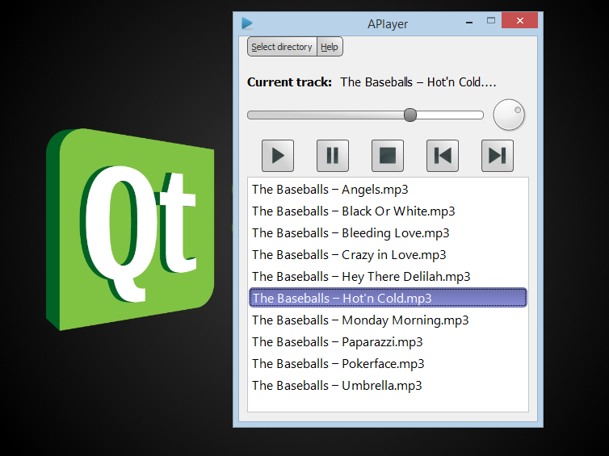
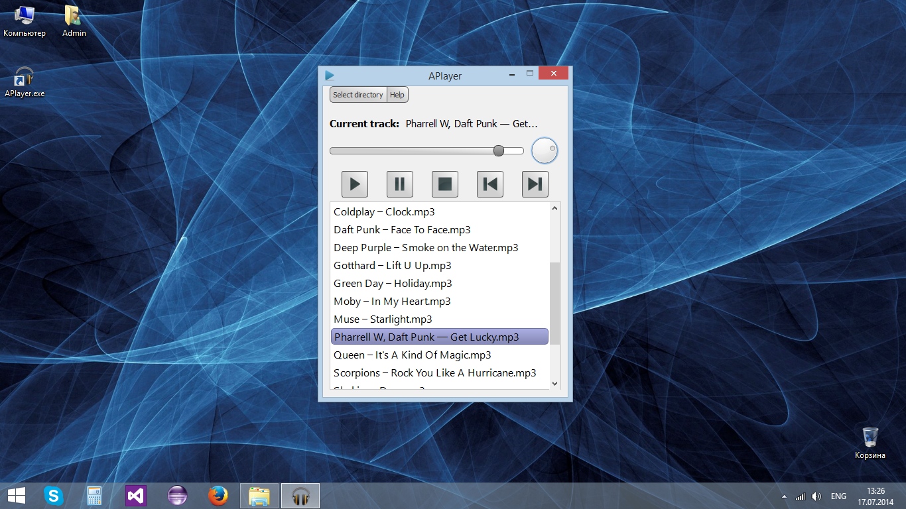

## APlayer - Yet another simple audio player for Windows 7/8

This is Windows application that play audio files (mp3) in the selected folder.

### Interface

Here are some screenshots of the interface:

### Usage

Import the root folder into your QtCreator, then run project.

### Download APlayer

Download the player at [this link] (https://yadi.sk/d/DfG0vDTwWrxke).

### Other

The source code is my first practise Qt in 2014 year.
